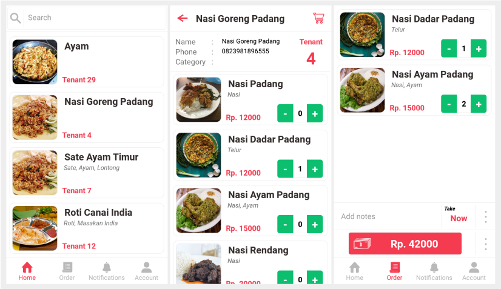

# Customer Application
 
## Introduction
Customer application is mobile-apps for canteens's customer and integrated to Canteen Information System (Final Project of System Information Course). This application has a purpose to manage and sumbit customer's order and payment to the system. This application built on NodeJS with React-Native for the Front-End and ExpressJS for the Back-End.

*Developed on Windows 10 for Android devices.*

## Features
1. View menu of every tenant in a canteen.
2. create and manage an order.
3. Submit a payment using cash or T-cash.
4. Manage customer's account.

## Previews

**Demo**: install [*apk release*](demo/apk-release.apk).

## Requirements
* *NodeJs 10.15.0*
* *Nodemon 1.18.9*
* *React-Native*
* *ExressJS 4.16.4*
* *XAMPP 7.3.1*
  
## Front-End: Mobile Apps
Using React-Native at [*customer-application*](customer-app/).
 
### **Installation**
1. Install *NodeJs* & NPM(included), see more at [NodeJS]( https://nodejs.org/en/download/).
2. Check *NodeJs* installation with `node --version`.
3. Install *React-Native*, see the guide at [React-Native]( https://facebook.github.io/react-native) and follow the instruction. 
4. Move to customer-app directory and install all the packages with `npm install`.
5. If you using a physical device, connect the device to the computer in developer mode with USB debugging.
6. Check your device connection to Android Debug Bridge by running `adb devices` and make sure if your device is already exists.
7. Run `adb device reverse tcp:8081 tcp:8081` for connection to React-Native Server. Also for the Back-End local server on port 5000 by running `adb device reverse tcp:5000 tcp:5000`.
8. Start React-Native Server with `react-native start`.
9. Install the application to the android device with `react-native run-android`.
   

## Back-End: REST API
Using ExpressJs at [*customer-server*](customer-server/).
 
### **Installation**
1. Install *NodeJs* & NPM(included), see more at [official website]( https://nodejs.org/en/download/).
2. Install nodemon globally `npm install -g nodemon`. 
3. Check *NodeJs* installation with `node --version`.
4. Move to customer-server directory and install all the packages with `npm install`.
5. Run the server with `nodemon`.
6. Server will be running at `http://localhost:5000/`.
7. Run XAMPP and create database `customer_app`.
8. Import [*customer.sql*](docs/customer.sql) to `customer_app` database.
